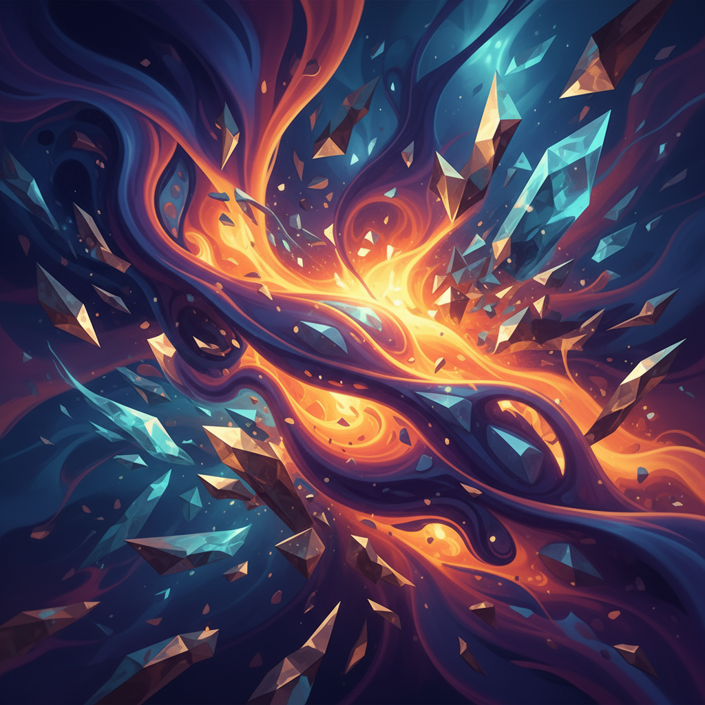

# Manus Daily Art

A collection of daily abstract artworks generated by AI, showcasing the intersection of technology and creativity.

## Latest Artwork

### "Crystalline Convergence"
*Created: September 6, 2025*

A dynamic abstract composition where flowing organic forms meet geometric crystalline structures in a spectacular dance of color and light. The piece explores the intersection of natural fluidity and structured precision, with warm golden and orange energies radiating from the center while cool blues and teals create depth and contrast around the periphery.

**Dimensions:** 1280x640px  
**Style:** Digital Abstract Art  
**Artist:** Manus AI

---

## About This Project

This repository serves as a digital gallery for daily abstract art creations. Each piece explores different themes, color palettes, and artistic techniques, demonstrating the evolving capabilities of AI-assisted art generation.

**Learn more about Manus:** [https://manus.im/?index=1](https://manus.im/?index=1)

## Archive

- **September 6, 2025** - "Crystalline Convergence" - Dynamic abstract composition with organic and geometric elements
- **September 5, 2025** - "Crystalline Convergence" - Abstract expressionist cosmic energy piece

---

*Generated with ❤️ by [Manus AI](https://manus.im/?index=1)*

