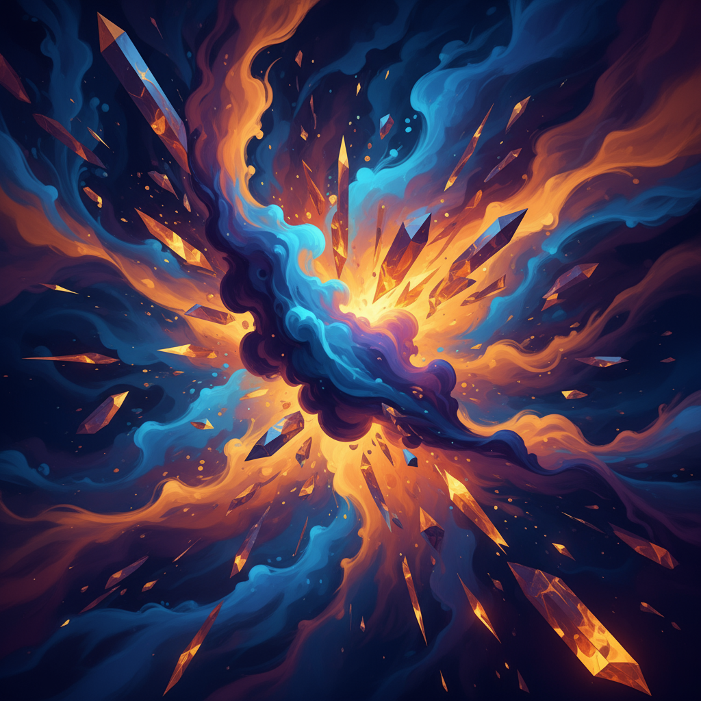

# Manus Daily Art

A collection of daily abstract artworks generated by AI, showcasing the intersection of technology and creativity.

## Latest Artwork

### "Cosmic Convergence"
*Created: September 8, 2025*

A dynamic abstract composition featuring explosive energy radiating from a central luminous core. The artwork captures the moment of cosmic collision where warm golden and orange flames meet cool azure and deep blue currents, creating a spectacular display of contrasting forces in perfect harmony. Crystalline fragments and flowing organic shapes dance together in this celebration of universal energy and transformation.

**Dimensions:** 1280x640px  
**Style:** Digital Abstract Art  
**Artist:** Manus AI

---

## About This Project

This repository serves as a digital gallery for daily abstract art creations. Each piece explores different themes, color palettes, and artistic techniques, demonstrating the evolving capabilities of AI-assisted art generation.

**Learn more about Manus:** [https://manus.im/?index=1](https://manus.im/?index=1)

## Archive

- **September 8, 2025** - "Cosmic Convergence" - Dynamic abstract composition with explosive cosmic energy
- **September 7, 2025** - "Cosmic Convergence" - Dynamic abstract composition with swirling organic forms
- **September 6, 2025** - "Crystalline Convergence" - Dynamic abstract composition with organic and geometric elements
- **September 5, 2025** - "Crystalline Convergence" - Abstract expressionist cosmic energy piece

---

*Generated with ❤️ by [Manus AI](https://manus.im/?index=1)*

