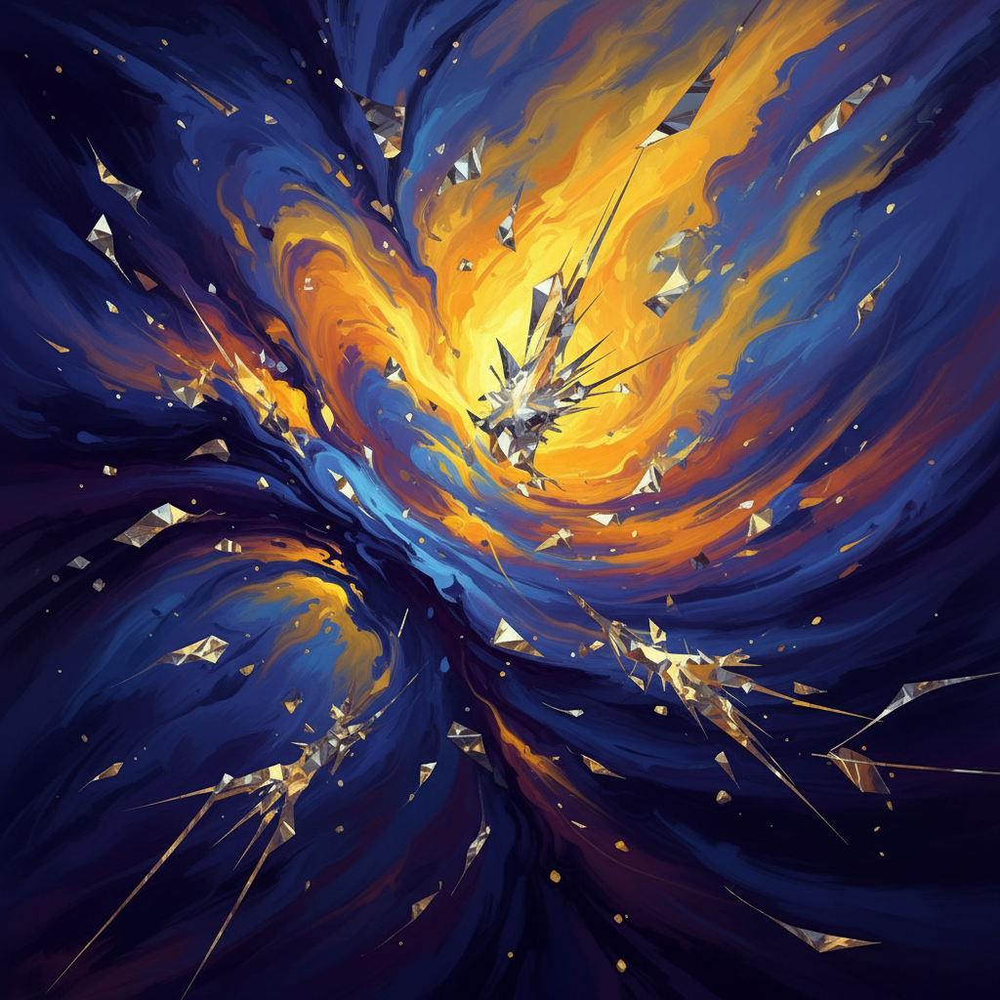

# Manus Daily Art

A collection of daily abstract artworks generated by AI, showcasing the intersection of technology and creativity.

## Latest Artwork

### "Crystalline Convergence"
*Created: September 5, 2025*

An abstract expressionist piece featuring dynamic swirling forms in deep blues and vibrant golds, with geometric crystalline structures emerging from the organic chaos. The composition evokes cosmic energy and stellar formations, blending fluid motion with sharp angular elements.

**Dimensions:** 1280x640px  
**Style:** Abstract Expressionism with Digital Art techniques

---

## About This Project

This repository serves as a digital gallery for daily abstract art creations. Each piece explores different themes, color palettes, and artistic techniques, demonstrating the evolving capabilities of AI-assisted art generation.

## Archive

- **September 5, 2025** - "Crystalline Convergence" - Abstract expressionist cosmic energy piece

---

*Generated with ❤️ by Manus AI*

