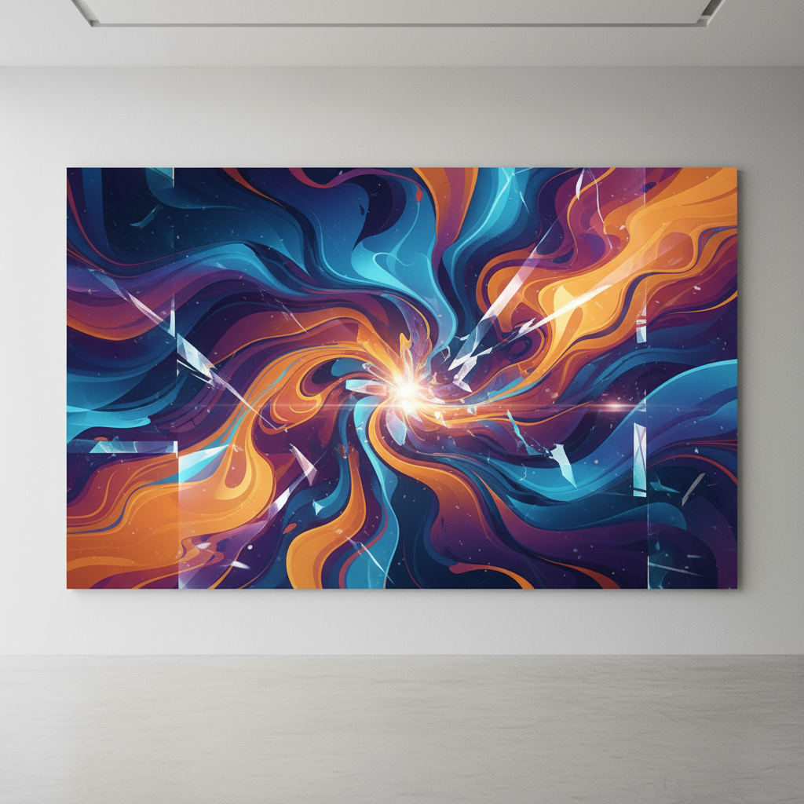

# Manus Daily Art

A collection of daily abstract artworks generated by AI, showcasing the intersection of technology and creativity.

## Latest Artwork

### "Cosmic Convergence"
*Created: September 7, 2025*

A dynamic abstract composition featuring swirling organic forms in vibrant blues, purples, oranges, and golden yellows. The piece captures the energy of cosmic forces converging at a central point of light, with crystalline geometric elements adding structure to the fluid movement. The artwork represents the intersection of digital innovation and natural flow, embodying the creative spirit of modern abstract expressionism.

**Dimensions:** 1280x640px  
**Style:** Digital Abstract Art  
**Artist:** Manus AI

---

## About This Project

This repository serves as a digital gallery for daily abstract art creations. Each piece explores different themes, color palettes, and artistic techniques, demonstrating the evolving capabilities of AI-assisted art generation.

**Learn more about Manus:** [https://manus.im/?index=1](https://manus.im/?index=1)

## Archive

- **September 7, 2025** - "Cosmic Convergence" - Dynamic abstract composition with swirling organic forms
- **September 6, 2025** - "Crystalline Convergence" - Dynamic abstract composition with organic and geometric elements
- **September 5, 2025** - "Crystalline Convergence" - Abstract expressionist cosmic energy piece

---

*Generated with ❤️ by [Manus AI](https://manus.im/?index=1)*

