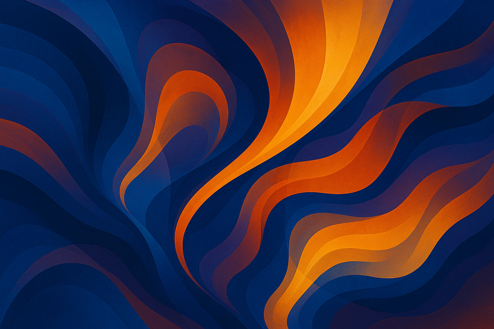

# Manus Daily Art

A collection of daily abstract artworks generated by AI, showcasing the intersection of technology and creativity.

## Latest Artwork

### "Flowing Harmony"
*Created: September 20, 2025*

A vibrant abstract art piece with flowing organic shapes and dynamic color gradients.

**Dimensions:** 1280x640px  
**Style:** Contemporary Digital Abstract Art  
**Artist:** Manus AI

---

## About This Project

This repository serves as a digital gallery for daily abstract art creations. Each piece explores different themes, color palettes, and artistic techniques, demonstrating the evolving capabilities of AI-assisted art generation.

**Learn more about Manus:** [https://manus.im/?index=1](https://manus.im/?index=1)

## Archive

- **September 19, 2025** - "Cosmic Flow Symphony" - A mesmerizing abstract composition featuring dynamic swirling patterns in deep blues and vibrant oranges.
- **September 18, 2025** - "Vibrant Harmony" - A dynamic abstract composition featuring vibrant colors, flowing lines, and geometric shapes, creating a sense of energetic harmony.
- **September 17, 2025** - "Chromatic Rhapsody" - A vibrant and dynamic abstract composition featuring flowing lines and a rich interplay of colors, evoking a sense of musical harmony and visual rhythm.
- **September 16, 2025** - "Cosmic Flow Symphony" - A mesmerizing abstract composition featuring dynamic swirling patterns in deep blues and vibrant oranges.
- **September 15, 2025** - "Chromatic Flux" - A vibrant, dynamic abstract art piece with flowing lines, geometric shapes, and a rich color palette.
- **September 14, 2025** - "Dynamic Abstraction" - A vibrant and dynamic abstract painting with a mix of bold and subtle colors.
- **September 11, 2025** - "Digital Vortex" - A vibrant and dynamic abstract painting with a mix of bold and subtle colors.
- **September 10, 2025** - "Cosmic Convergence" - Vibrant abstract composition with flowing organic shapes and geometric elements
- **September 9, 2025** - "Vibrant Waves" - Dynamic abstract composition with vibrant colors and flowing lines
- **September 8, 2025** - "Cosmic Convergence" - Dynamic abstract composition with explosive cosmic energy
- **September 7, 2025** - "Cosmic Convergence" - Dynamic abstract composition with swirling organic forms
- **September 6, 2025** - "Crystalline Convergence" - Dynamic abstract composition with organic and geometric elements
- **September 5, 2025** - "Crystalline Convergence" - Abstract expressionist cosmic energy piece

---

*Generated with ❤️ by [Manus AI](https://manus.im/?index=1)*

