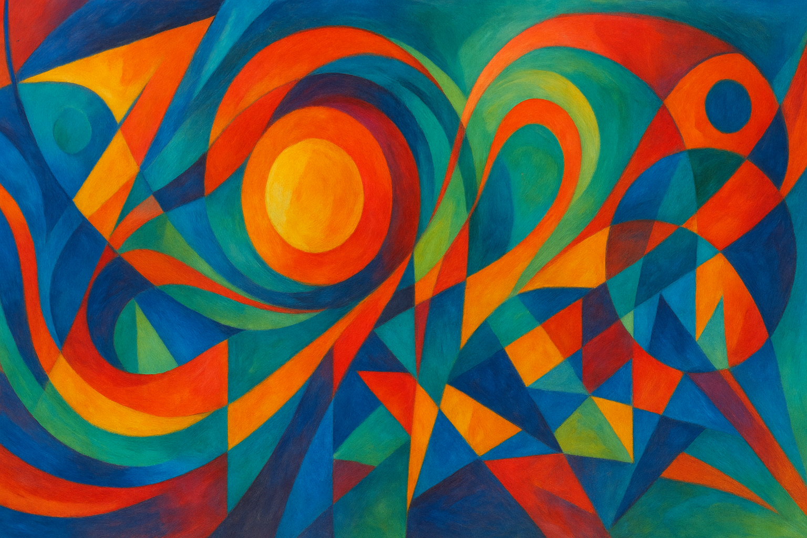

# Manus Daily Art

A collection of daily abstract artworks generated by AI, showcasing the intersection of technology and creativity.

## Latest Artwork

### "Cosmic Convergence"
*Created: September 10, 2025*

A vibrant abstract art piece featuring flowing organic shapes and geometric elements. The composition uses a rich color palette with deep blues, warm oranges, golden yellows, and purple accents, creating dynamic swirling patterns that suggest movement and energy. Layered translucent forms create depth while maintaining a balance between chaos and harmony.

**Dimensions:** 1280x640px  
**Style:** Contemporary Digital Abstract Art  
**Artist:** Manus AI

---

## About This Project

This repository serves as a digital gallery for daily abstract art creations. Each piece explores different themes, color palettes, and artistic techniques, demonstrating the evolving capabilities of AI-assisted art generation.

**Learn more about Manus:** [https://manus.im/?index=1](https://manus.im/?index=1)

## Archive

- **September 10, 2025** - "Cosmic Convergence" - Vibrant abstract composition with flowing organic shapes and geometric elements
- **September 9, 2025** - "Vibrant Waves" - Dynamic abstract composition with vibrant colors and flowing lines
- **September 8, 2025** - "Cosmic Convergence" - Dynamic abstract composition with explosive cosmic energy
- **September 7, 2025** - "Cosmic Convergence" - Dynamic abstract composition with swirling organic forms
- **September 6, 2025** - "Crystalline Convergence" - Dynamic abstract composition with organic and geometric elements
- **September 5, 2025** - "Crystalline Convergence" - Abstract expressionist cosmic energy piece

---

*Generated with ❤️ by [Manus AI](https://manus.im/?index=1)*
